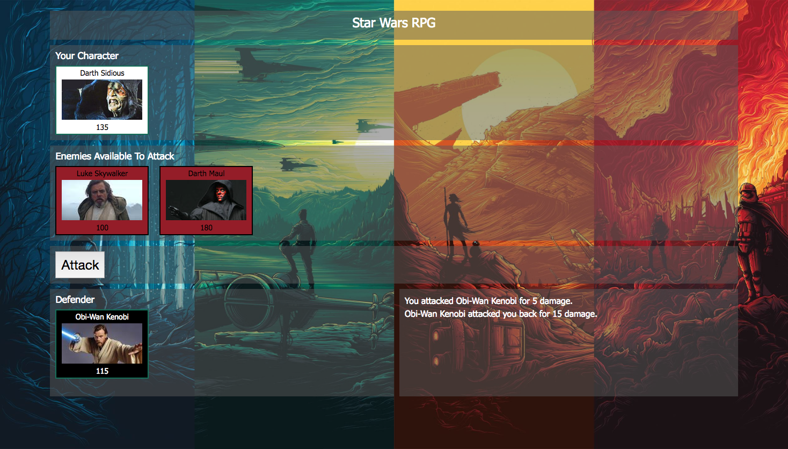

# Start Wars RPG game

### [Play the game](https://merrazquin.github.io/star-wars-rpg/)

### How the app works:

* When the game starts, the player will choose a character by clicking on the fighter's picture. The player will fight as that character for the rest of the game.

* The player must then defeat all of the remaining fighters.

* The player chooses an opponent by clicking on an enemy's picture.

* Once the player selects an opponent, that enemy is moved to a `defender area`.

* The player will now be able to click the `attack` button.
     * Whenever the player clicks `attack`, their character damages the defender. The opponent will lose `HP` (health points).
     * The opponent character will instantly counter the attack. When that happens, the player's character will lose some of their `HP`.

* The player will keep hitting the attack button in an effort to defeat their opponent.

   * When the defender's `HP` is reduced to zero or below, the enemy is removed from the `defender area`. The player can now choose a new opponent.

* The player wins the game by defeating all enemy characters. The player loses the game if their character's `HP` falls to zero or below.

* The players should be able to win and lose the game no matter what character they choose. The challenge should come from picking the right enemies, not choosing the strongest player.

### Developed with
* JQuery
* HTML5
* CSS3
